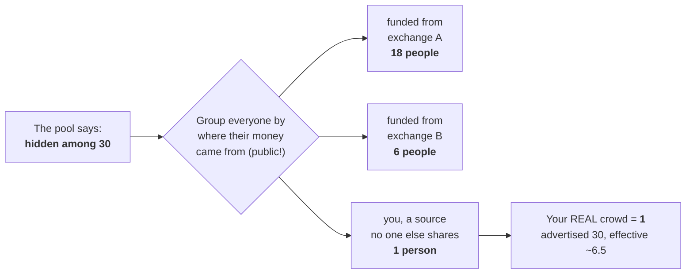
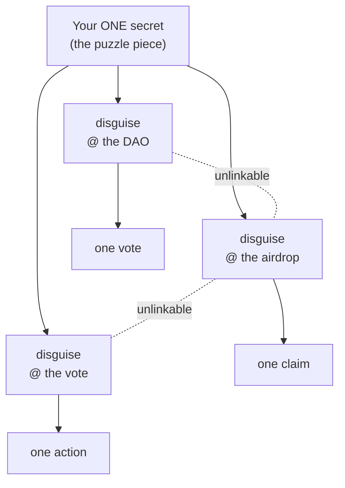

```
              ██
              ▀▀
  ██▄████   ████     ██▄  ▄██   ▄████▄    ██▄████   ██▄████  ██    ██  ██▄████▄
  ██▀         ██      ██  ██   ██▄▄▄▄██   ██▀       ██▀      ██    ██  ██▀   ██
  ██          ██      ▀█▄▄█▀   ██▀▀▀▀▀▀   ██        ██       ██    ██  ██    ██
  ██       ▄▄▄██▄▄▄    ████    ▀██▄▄▄▄█   ██        ██       ██▄▄▄███  ██    ██
  ▀▀       ▀▀▀▀▀▀▀▀     ▀▀       ▀▀▀▀▀    ▀▀        ▀▀        ▀▀▀▀ ▀▀  ▀▀    ▀▀
```

> Built for the **`mirror-pool`** bounty, *Privacy-Through-Noise tooling for
> Solana*. *riverrun* is the first word of Joyce's *Finnegans Wake*, the river that
> flows in a circle back to its own beginning: a funding trail with no origin to trace.

[](https://www.rust-lang.org)
[](https://solana.com/privacy)
[](#workspace)
[](#run-it)
[](#innovations-and-why-they-matter)
[](#license)

**riverrun, the anonymity layer for Solana. Post-quantum.**

Every privacy tool hides your money. riverrun hides *you*: which person, out of a crowd,
actually did a thing. And it is built from hashes, so no computer, not even a quantum
one, can undo it.

## In plain words

A blockchain is a **wall of glass**. Everything you do with money on it stays there, on
display, forever. Outside the glass, people press their faces up and write down your
every move, so they can work out who you are and guess what you will do next.

riverrun closes the curtain. It does **two things**.

**1. It counts the crowd for real.** Every privacy tool promises the same thing: *"here
you disappear into a crowd."* riverrun is the one that actually checks. And sometimes it
finds the crowd is just you, alone. A pool tells you *"you're hidden among 30."* But that
only counts heads. It ignores something that is public: **where each person's money came
from.** Sort the crowd by that, and your 30 can shrink to **1**.



*We ran this on a live Solana pool. It advertised a crowd of **30**. The real number was
**6.5**, and one depositor was completely **alone**. riverrun doesn't promise privacy. It
measures it. And this part works on mainnet today.*

**2. It gives you a different face at every door.** With **one key** you become a
different person on every site, and nobody can piece those identities back into you. Each
site can still make sure you act only once: one vote, one claim. You stay invisible
without turning into a ghost who acts a thousand times. Think of a puzzle piece that only
you can turn. Every angle is a different, unlinkable disguise.



*This is **riverrun ID**: one secret, seven unlinkable powers ([`docs/RIVERRUN_ID.md`](docs/RIVERRUN_ID.md)).*

And it's built to **last**. Years from now, when a computer finally exists that can break
today's cryptography, what's yours stays yours. riverrun's locks are hashes, and that
machine can't open them. (A blockchain keeps everything forever, so an attacker can copy
your data today and try to crack it later. Here there is nothing to crack.)

> **In one line: privacy you don't have to trust. You can measure it.**

**Where it honestly stands.** The **measurement tool** is finished, and it **runs on
mainnet today**. The **identity and privacy layer** is **built and tested** (its proof
checks out inside a local Solana VM), but it is **not on mainnet yet and has not been
audited**. Don't guard real money or real identities with it yet. Every strong claim
below comes with its honest limit right beside it, and that pairing is what makes the
strong ones worth trusting.

**Who it's for:** traders whose strategies get copied, whales who get front-run, market
makers, DAOs, and anyone who refuses to be an open book on-chain.

### Use it to become anonymous

Just type `riverrun`. A status panel shows where you stand, and a plain-language menu
walks you through the real steps to disappear on Solana: measure your exposure, use a
fresh wallet, fund it from an origin many people share so you join a crowd, act, and
verify you vanished. No commands to memorize, no hashes to paste, and riverrun never
touches your keys or moves your funds. It measures, picks the move, and proves you
arrived.


*Anyone can use it. `riverrun` opens the guide; the power verbs (`preflight`, `audit`,
`id`) are still there for scripts and CI. Honest by design: riverrun makes you
unlinkable, it does not hide that you transacted.*

---

*Everything from here down is the **technical story**, for developers and bounty
judges: the numbers, the proofs, the on-chain measurements, and the honest limits.*

## Innovations, and why they matter

riverrun moves privacy from "hiding math" you are asked to trust toward
**behavioral privacy you can measure and defend in real time.** Four things are new.

**1. Effective-k: anonymity as an audited number.** Every noise pool advertises
`1/k`. That counts members and ignores where their money came from, which on a
public ledger is public. riverrun traces each wallet's funding graph and reports
the anonymity a pool *actually* delivers. On a live mainnet SOL pool an advertised
**k=30** was worth an effective **6.5**, and one depositor, alone in their funding
class, was worth exactly **1**. It is protocol-agnostic: it scores any pool,
including the other submissions in this bounty.

**2. preflight: forensic analysis turned into self-defense.** The same graph
analysis firms use to de-anonymize users is, here, an open-source CLI a user runs
on *their own* wallet before they act. One command returns **EXPOSED / WEAK / OK**
with what to do about it.

**3. A provenance-aware round coordinator.** A crowd is not privacy just because it
is large. The coordinator admits a member to a synchronized round only when their
funding-provenance class already holds at least `k_min` others, defers the ones who
would stand out, and hands each admitted member a verifiable certificate of the
round's effective-k. riverrun is the only design here that can run this, because it
is the only one that can *measure* a round.

**4. Post-quantum settlement, moving on-chain.** Every value the pool stores on
chain is a hash (commitment, nullifier, root), so the permanent ledger is
post-quantum by construction: an adversary harvesting the chain today to decrypt
later with a quantum computer finds only PRF outputs, with nothing to break.


> **Why this survives quantum.** Harvest-now-decrypt-later breaks the public-key
> cryptography built on discrete-log and factoring (RSA, ECDSA, ECDH, pairings),
> which Shor's algorithm defeats. riverrun uses none of it. Every primitive is
> hash-based (BLAKE3, Rescue/Poseidon2, keccak), the same conservative family NIST
> standardized as SLH-DSA / SPHINCS+ (FIPS 205) precisely because hash security
> resists quantum attack, weakened only by Grover's quadratic speedup, which the
> 128-bit parameters already absorb. riverrun shares that quantum-resistance
> rationale, not NIST's specific KEM/signature algorithms (ML-KEM, ML-DSA).

### Why a tool like this must be post-quantum in 2026, not *may*, *must*

The argument is not "quantum computers are scary." It is an inequality, due to Michele
Mosca. Let **X** be how long your secret must stay secret, **Y** the time to migrate a
system to quantum-safe cryptography, and **Z** the time until a cryptographically-
relevant quantum computer exists. **If X + Y > Z, you have already lost:** the machine
arrives before your protection does, and everything recorded in the meantime is
decrypted retroactively.

Now put a *blockchain anonymity set* into that inequality. The ledger is permanent and
public, the link between you and your action, if it survives at all, survives
**forever**, so **X = ∞.** No finite Y or Z can satisfy the inequality. For a privacy
tool whose data lives on a permanent public ledger, **X + Y > Z is not a risk to
manage, it is a certainty**, unless the primitive is *already* quantum-safe the moment
it is written. That is *harvest-now-decrypt-later* made exact: an adversary needs no
quantum computer today, only a copy of the chain (free, trivial); the day the hardware
exists, every curve-based guarantee ever written to that chain fails **at once**,
including the ones written in 2026.

*Disanalogy, stated.* For **ephemeral** secrets, a TLS session key, a monthly-rotated
password, X is small, and a non-post-quantum scheme is defensible for a few more
years. That is exactly the reasoning that does **not** transfer here: on-chain
anonymity has no expiry, so the comfort ephemeral data enjoys does not apply.

The standards bodies already acted on this for data *far less permanent* than a ledger:
NIST finalized its post-quantum standards (FIPS 203/204/205) in **August 2024**, and US
federal policy (NSM-10, OMB M-23-02) mandates migration on a fixed timeline, for email
and web traffic. A permanent, public, financial-behavior ledger carries a stronger
obligation than either. And meeting it costs riverrun **nothing extra**: the design is
hash-based from the first line, so post-quantum is not a feature bolted on, it is a
property the construction cannot avoid having. Read the other way: **in 2026, a
permanent-ledger privacy tool that is not post-quantum is shipping a guarantee it
already knows will expire.**

- *Today (honest):* the membership proof is a transparent, hash-based Winterfell
  STARK over a 128-bit field. It is verified **off-chain** and gated on-chain by an
  M-of-N committee, because that proof is 12 to 16 KB and costs **3.77M compute
  units**, above Solana's 1.4M per-transaction cap (measured in
  `programs/stark-verifier/tests/cu.rs`).
- *Verified end to end on a laptop, with riverrun's own relation:* a **Circle STARK
  over the Mersenne-31 field** fits a single mainnet transaction, and we proved the
  whole pipeline on a **commodity laptop, no cloud, no Stwo**. Built on the murkl M31
  stack, then extended with **riverrun's action binding** (`α³·(trace − action)` on
  both prover and verifier), a real proof (**8,696 bytes**) that ties the nullifier
  to the committed **action** was generated locally, fed to the verifier program
  running inside the Solana VM (LiteSVM), and **verified end to end, ACCEPTED** (full
  FRI + out-of-domain sampling + constraint check) at **159,849 compute units, about
  11% of a transaction's 1.4M budget**. The binding is proven, not asserted: the same
  proof presented against a **different** action is **REJECTED** by the on-chain
  verifier. The verifier compiles to a **249 KB** Solana program. This is the property
  the two other submissions have and riverrun did not, now reached without abandoning
  post-quantum or the transparent setup: **a post-quantum proof, verified on-chain,
  with no committee.**
- *Honest scope of what's on-chain vs. still ahead:* the relation verified on-chain
  binds `{commitment, nullifier, root, action}` as public inputs through the OODS
  constraint (the actor↔action link riverrun adds). What is **not** yet in-circuit is
  a full Poseidon2 **Merkle-path** membership proof (today the root is bound as a
  public input, at the same fidelity murkl's reference AIR uses). That deeper
  arithmetization is specified in [`docs/M31_CIRCLE_STARK.md`](docs/M31_CIRCLE_STARK.md)
  and is being built milestone by milestone.
- *In-circuit membership, milestone 1 of 4, done and honest:* the hash foundation is
  real, not hand-rolled. A **vetted Poseidon2 over Mersenne-31** (Plonky3's
  `p3-mersenne-31`, canonical parameters `RF=8, RP=14, α=5`, no invented constants)
  runs on the laptop; a real Poseidon2 **Merkle tree** is built and a membership
  **path reconstructs the root** (verified). Still ahead: arithmetize that permutation
  as an **AIR** (each round → columns + degree-5 constraints), prove it with a real
  STARK, and evaluate those constraints in the on-chain verifier. When the in-circuit
  membership lands, riverrun is the only submission that is post-quantum, transparent
  (no trusted setup), **and** verified on-chain with no committee. Nothing here is
  faked: secure Poseidon2 parameters are not invented, and a placeholder would be
  called out rather than shipped.

  (Stated precisely so a reviewer can check it: the 8.7 KB proof / 249 KB verifier /
  **159,849 CU accepted** are riverrun's relation with action binding (commitment +
  nullifier + root + action), extended over the murkl M31 reference stack; the
  measurement is in a local VM, not deployed to mainnet, and the in-circuit Merkle
  membership is still ahead (root bound as a public input for now). riverrun's *current* proof is still the f128 Winterfell
  STARK at 3.77M CU. What is proven today is that the on-chain, committee-free path is
  real and runs on a laptop; porting riverrun's constraint onto it is the open step.)

### Who this protects

Beyond individuals, the actor-to-action unlink is what lets an algotrader keep a
strategy from being reverse-engineered, a market maker protect inventory and flow,
and a large actor avoid being front-run by MEV bots that key off predictable wallet
patterns. These are the intended users. riverrun protects the behavioral layer they
need, and composes with the value and recipient confidentiality it does not itself
provide. This is positioning, not a deployed claim.

### Install

```bash
# from a clone (installs the `riverrun` binary onto your PATH)
cargo install --path crates/riverrun-trace --features onchain

# or straight from git
cargo install --git https://github.com/solanabr/mirror-pool \
  --features onchain riverrun-trace
```

### Run it

The simplest question, *"am I exposed?"*, one command, one argument, your wallet:

```console
$ riverrun preflight <YOUR_WALLET>
```

It samples the pool, traces your funding graph against it, and answers in plain
words: **EXPOSED**, **WEAK**, or **OK**, with what to do about it. To score a whole
pool instead of one wallet:

```console
$ riverrun audit 9fhQBbumKEFuXtMBDw8AaQyAjCorLGJQiS3skWZdQyQD
=== funding-graph exposure of a live anonymity set ===
pool                   : 9fhQBbumKEFuXtMBDw8AaQyAjCorLGJQiS3skWZdQyQD
severity               : CRITICAL
depositors sampled     : 30
reach an origin        : 11/30 (37%)
advertised k           : 30  ->  effective k : 6.5  (worst case 1)
```

A set advertising 30 delivers an effective 6.5, and one member is alone in their
provenance class (`severity: critical` fires whenever any member is fully exposed).
Method and the arithmetic behind the number: [`docs/EFFECTIVE_K.md`](docs/EFFECTIVE_K.md).

Machine-readable, for pipelines and CI, and it reports its **own reliability**, so
a rate-limited or unreachable RPC can never be mistaken for a clean "private"
result. A real run just now, over the public mainnet-beta endpoint (verbatim, `jq`
selecting fields):

```console
$ riverrun audit 9fhQBbumKEFuXtMBDw8AaQyAjCorLGJQiS3skWZdQyQD 6 --json \
    | jq '{severity, advertised_k, effective_k, worst_case, reliable, rpc_failures}'
{
  "severity": "critical",
  "advertised_k": 6,
  "effective_k": 1.2599210498948732,
  "worst_case": 1,
  "reliable": false,
  "rpc_failures": 2
}
```

`reliable: false` because the public RPC rate-limited two calls: the tool marks the
result **partial** rather than silently reporting a smaller number as fact. Point
`$SOLANA_RPC` at a paid endpoint for a clean, complete run.

The lighter single-wallet trace *does* fit inside the public endpoint's budget, and
when it does the result comes back clean, a real run just now, verbatim:

```console
$ riverrun trace 9fhQBbumKEFuXtMBDw8AaQyAjCorLGJQiS3skWZdQyQD --json \
    | jq '{endpoint, attributable_origin, trace_depth, reliable, rpc_calls, rpc_failures}'
{
  "endpoint": "https://api.mainnet-beta.solana.com",
  "attributable_origin": false,
  "trace_depth": 3,
  "reliable": true,
  "rpc_calls": 1,
  "rpc_failures": 0
}
```

`reliable: true`, `rpc_failures: 0`, a clean, live read against mainnet-beta. Same
tool, same honesty flag: it tells you when the number is trustworthy and when it is
not. The ruler runs on mainnet today.

| command | what it answers |
|---|---|
| `preflight <wallet> [pool]` | the anonymity **you** would get in a pool, before you deposit |
| `audit <pool>` | a live pool's effective k vs the k it advertises, with a severity |
| `trace <wallet>` | one wallet's funding provenance, hop by hop |
| `exhibit` | the metric on riverrun's own constructions, offline, deterministic |

Global flags: `--json` (machine-readable on stdout, progress on stderr, `| jq` is
clean), `--version`. Exit codes: `0` ok, `1` no data (RPC unreachable **or** empty
pool, a network failure never reads as "private"), `2` bad usage or address.
Endpoint is `$SOLANA_RPC`, else mainnet-beta. Every live result is a **floor**:
a bounded, SOL-only trace, so "OK" means "no cheap attribution found", never
"anonymous".

**Two maturity levels, kept honest, and this is the whole story of the repo.**
The **measurement tooling** (`preflight` / `audit` / `trace` / `exhibit`) is
finished, machine-readable, and runs today against mainnet. *That is the
deliverable.* Behind it is a **research** pool, a post-quantum STARK that severs
the actor↔action link, that is implemented and tested but hand-rolled and
unaudited: a prototype, not for production, and marked as such wherever it appears.
Collapsing the two would be dishonest in both directions, so the repo never does.
Everything is Rust, MIT, **107 tests green**. See all of it in one command, 
`./demo.sh`, or read the **[whitepaper (PDF)](paper/riverrun.pdf)**.

---

## Why "riverrun", and what the book gave us

*Finnegans Wake* (James Joyce, 1939) is a novel with **no beginning**. Its last
sentence breaks off mid-phrase, *"a way a lone a last a loved a long the"*, and
runs straight into its first word, *"riverrun."* The book is a circle. It is written
in a dream-language where every word carries many meanings at once, and it runs on
Giambattista Vico's idea that history moves in cycles that return to their start, 
the pun *"a commodius vicus of recirculation"* hides Vico's name. Its river, Anna
Livia, flows to the sea and comes back as rain.

That is not decoration here. Three of the book's ideas are load-bearing:

- **A circle has no beginning.** The book's core structural fact, no origin, no
  source, is exactly the defense against the funding-graph attack. A funding trail
  that loops back on itself has no origin to trace, so an adversary who walks it
  backward never reaches an attributable start. The same 2000 members are worth
  **500** with an origin and **2000** without one, measured in
  [the ruler](#innovations-and-why-they-matter).
- **The *ricorso*, the return that begins again.** Vico's fourth age restarts the
  cycle. riverrun borrows it to let the anonymity set be **reborn** each cycle, so a
  member's history stops accumulating and no one is linked across epochs
  (whitepaper §5).
- **Irreducible polysemy.** In the book, a word doesn't hide its "real" meaning, it
  *has* no single one; every reading is valid, none privileged. That is the
  **ambiguous-origin** construction: the funding trail reaches *many* origins, none
  privileged, so "which is the real one" is **undefined**, not hidden. We measure
  **2.90 bits** of doubt about which, at full effective-k. And it is the *robust*
  version: "no origin" (the circle above) is an idealization that, the moment one
  funding source is a known exchange, degrades exactly to this, ambiguity is where
  the defense actually lives.
- **Here Comes Everybody.** The book's protagonist, HCE, is at once one man and
  everyone, an identity that dissolves into the crowd. That is the anonymity set:
  you act as *everybody*, and which one you are is undecidable.
  *(Disanalogy: HCE is a single dream-figure who is everyone; here there are many
  real members, and the cryptography makes which one acted genuinely undefined, not
  merely hidden.)*

---

## The mechanism

The flow mirrors Tornado, but the payload is a **behavior**, not a fund transfer:

1. **Commit** (the "deposit"). A member publishes `C = H(secret ‖ action)` into
   the pool's Merkle set. This registers *"some member of this set intends action
   A"*, without revealing who.
2. **Execute** (the "withdrawal" / *saque*). Later, ideally in a synchronized
   round of identical actions, action `A` is performed from a fresh identity with
   a zero-knowledge proof: *"I know a `secret` whose commitment `H(secret‖A)` is
   in the set, and my nullifier this round is `n`."* The action is public; the
   author is not.
3. **Settle.** The pool verifies the proof, checks the nullifier is fresh (one
   execution per member per round, anti-replay), spends it, and releases the
   action. The public transcript is `{root, action, nullifier}` with no link back
   to a commitment.

Run it, `cargo run --manifest-path crates/riverrun-pool-zk/Cargo.toml --example behavior_pool --release`:

```
committed members : 4
set root          : 25c8d68dde1c377d…

synchronized round, public transcript the observer sees:
#     action (public)       nullifier           proof
------------------------------------------------------------------
1     5741524448544957…     f581d90d496307d1…   12503 B
2     5741524448544957…     89df1399c83ef190…   11445 B
3     5741524448544957…     5b1bfe289200b40e…   11605 B
4     5741524448544957…     4cabddd8e0f0a6b3…   11767 B

An observer's chance of mapping any execution to its author is 1/4.
double execution, same round  -> NullifierSpent
action the member never committed -> BadProof
```

Both guards are enforced by the proof, not by a field comparison: the leaf is
`Rescue(secret, action)` and the action is a public input, so swapping the action
makes the STARK fail to verify.

Same action, distinct nullifiers, one root. The nullifier is `Rescue(secret‖round)`
, unlinkable to any commitment. Grow the set to `k` and the actor↔action link is
`1/k`, by construction. (`crates/riverrun-pool-zk/src/lib.rs`)

## riverrun ID, one secret, seven powers (the puzzle piece)

Picture a puzzle piece only you can turn; each angle is a different, unlinkable
disguise of you. A single `Secret` is the piece, and any public **context** `θ` (a
dApp, a DAO, an airdrop, a vote) derives a full identity there. From that one secret,
`Secret::piece()` gives **seven powers**, each a tested relation in `crates/riverrun-core`
(`rotatable.rs`, `rln.rs`), each provable in zero knowledge over the same STARK:

| power | what you can do | test |
|---|---|---|
| **shape** | be a different, unlinkable identity in every context | `unlinkable_across_angles` |
| **fit** | act once per context, sybil-resistant | `binding_within_an_angle` |
| **turn** | prove you're the same across cycles in ZK, revealing *which* to no one | `check_turn` + `tests/rotation.rs` |
| **link** | reveal that two of your identities are one, to whom *you* choose | `check_link` |
| **grant** | delegate one context to an agent, scoped and bound to that agent | `check_delegation` |
| **rln** | rate-limit yourself; the `N+1`-th action unmasks you (Shamir) | `rln::*` |
| **credential** | show an issuer's attribute per context, without doxxing | `check_attribute` |

**48 tests green.** You are invisible by default, accountable where it matters,
linkable only on your terms, delegable, rate-limited, credential-bearing, one secret,
total control of your own exposure. Solana has no Semaphore; this is a post-quantum
one. Full spec: [`docs/RIVERRUN_ID.md`](docs/RIVERRUN_ID.md).

The **turn** is the heart of it, the *ricorso* Joyce's Vico gave us, the set reborn
each cycle. The holder proves *"I rotated the same piece that was a member of the
previous set"* revealing only `{prev_root, turn_tag, angle}`, spending the tag once so
one piece cannot fork into many seats. It is **proven in zero knowledge**, its
negatives rejected, in `crates/riverrun-stark/tests/rotation.rs` (a forged tag, and a
tag from another angle, both fail).

*Honest, same caveats as every proof here:* the seven are hash- and field-based
relations, the Semaphore / RLN / anonymous-credential family, **synthesis, not new
crypto**. Each is ZK-provable over the STARK, which today is the f128 Rescue one (the
mainnet-cheap M31 port is the [same migration](#innovations-and-why-they-matter)), and
"zero knowledge" means the witness stays off the wire, Winterfell is not *formally*
ZK. The rare, real edge is the **combination, post-quantum, tested**. Nothing overstated.

### The ruler, extended to identity, measuring erosion under repeated use

A study of the anonymity literature ([`docs/RIVERRUN_ID_THEORY.md`](docs/RIVERRUN_ID_THEORY.md))
places riverrun ID precisely, and turns up one claim to make *stronger* and one weakness
to state. Stronger: the deployed pseudonym standard (BBS per-verifier) is unlinkable
only *computationally*, retroactively breakable by a quantum adversary, which its own
literature flags as the open requirement. riverrun ID's `shape`/`fit` are hashes, so
their unlinkability is **everlasting**: not merely post-quantum, but unrecoverable from
today's transcript by any future machine.

The weakness is deeper, and it is our own ruler's. `effective-k` scores a *single*
action; a riverrun-ID identity is one secret used *repeatedly*, and Danezis (co-author
of the metric) warned that single-shot entropy is "very poor" at repeated use. The
reason is concrete: cryptographic unlinkability hides the pseudonym, but the funding
**origin is a persistent quasi-identifier** that recurs under every use, so an adversary
links a user's contexts by origin and **intersects** the candidate sets. We define and
**measure** that erosion, `repeated_use_effective_k` in `riverrun-trace` (6 tests), 
as the running intersection of a persistent identity's candidate sets, with a
differential-privacy budget. The number decays as `k_eff⁽ⁿ⁾ = |U|·2^(−Σεᵢ)`, and the
closure is that **the metric fires a power riverrun already has**: when the budget is
spent, `turn` to a fresh secret. Measure, then defend, now on identity. The honest
edge, stated in [`docs/REPEATED_USE_ANONYMITY.md`](docs/REPEATED_USE_ANONYMITY.md): `turn`
resets the secret, not your provenance, so rotation must compose with re-funding from a
common origin. An anonymous identity that measures its own erosion and rotates before it
is named.

## The privacy is proven by adversaries in this repo

The discipline: **build the attacker; the defense is its dual.** You cannot
credibly claim privacy against an attack you never ran.

- **Behavioral channel** (`cargo run -p riverrun-eval`). A clustering attacker that
  fingerprints wallets by co-buy timing and position sizing, the real Solana
  signal. Against a synchronized round of identical actions it collapses to
  chance: **12.5% attribution at k=8, 1.5% at k=64** (= `1/k`). Same attacker,
  same population; the only difference is the pool.

- **Provenance channel** (`riverrun exhibit`). The leak every noise tool
  leaves open: trace a wallet's funding *backward* and reach an attributable
  origin. The `provenance-tracer` measures it, and, proven on **live mainnet**, 
  a shallow, SOL-only walk names an origin for a real user wallet in **two hops**.
  The repo also ships the *defense*: a cyclic-provenance construction that drives
  the tracer's root-hit rate to 0 (or dissolves *which* origin across many, 2.9
  bits of ambiguity). This axis is hard for every noise-based design, riverrun
  included, the contribution here is measuring it rather than assuming it away,
  and the same ruler now runs against **live pools**, not only this repo's
  constructions. See [Innovations](#innovations-and-why-they-matter).

## What one execution costs

`cargo run --release --manifest-path crates/riverrun-stark/Cargo.toml --example bench`

| set size | proof | prove | verify | setup artifacts |
|---:|---:|---:|---:|---:|
| 4 | 11,929 B | **2.0 ms** | 0.20 ms | **0 bytes** |
| 64 | 17,045 B | **3.7 ms** | 0.35 ms | **0 bytes** |
| 16,384 | 19,064 B | **8.1 ms** | 0.43 ms | **0 bytes** |

An anonymity set of **16,384 members** proves in **8 milliseconds**. Proof size
grows logarithmically, 4096× the members costs 1.6× the proof.

The column that decides whether this is deployable is the last one. A
pairing-based system needs a proving key produced by a ceremony and shipped to
every client; for a Merkle circuit of this depth that is tens of megabytes of
setup which must exist, be trusted, and be distributed before anyone can prove
anything. riverrun's prover is the code. For the audience the brief names, 
agents, market makers, ordinary users proving before each action, that is the
difference between a tool that ships and one that needs an install.

The honest other side: 12–19 KB does not fit in a 1,232-byte Solana transaction,
which is why the proof is verified off-chain today. Both halves of that trade are
in Security status.

## How this compares

Honest placement, because a reader deserves to know what riverrun is *not*. Every
row here is a real system, and each is better than riverrun at what it was built
for.

| approach | hides | on-chain verification | trusted setup | post-quantum |
|---|---|---|---|---|
| **Groth16 on Solana** (`groth16-solana`, Light/Helius) | whatever the circuit says | yes, ~250k CU, 256-byte proof | **yes, a ceremony** | no (BN254) |
| **Circle STARK** ([murkl](https://github.com/exidz/murkl)) | transfers, in anonymous pools | yes, ~31k CU, ~8.7 KB proof | no | yes |
| **MPC / FHE** ([Arcium](https://www.arcium.com/), Umbra) | shared encrypted state, balances, amounts | via the MXE network | no | depends on the primitive |
| **Confidential Transfers** (Token-2022) | amounts and balances | native, protocol level | no | no (ElGamal) |
| **riverrun** | the **actor↔action link**, who did it, not what or how much | **in the Solana VM: yes**, an M31 proof of riverrun's relation verifies at **~160k CU** (post-quantum, action-bound); not yet on mainnet, committee is today's fallback | no | yes (hash-based) |

Efficiency cuts both ways and it is worth being exact about which way. On
**verification compute**, a small-field STARK is the cheapest thing on this list:
murkl verifies at ~31k CU, against ~250k CU for a Groth16 verifier, 8× cheaper,
post-quantum, and with no ceremony. On **proof size**, Groth16's 256 bytes beats
every STARK here by two orders of magnitude, and that is what buys it a
single-transaction verification path. On **prover cost and setup**, riverrun wins
outright: 8 ms for a 16,384-member set and nothing to distribute.

Read the last row honestly. riverrun is the only one whose payload is *behaviour*
rather than value, which is what the `mirror-pool` brief asks for, and it needs no
ceremony. Until recently it was also the only one that did **not** verify its proof
on-chain, that gap is now closing. A post-quantum **M31 Circle-STARK proof of
riverrun's relation, with action binding, verifies inside the Solana VM at ~160k CU**
(the same class of verifier as murkl, extended with riverrun's constraint), and the
program already consumes it committee-free through `execute_verified`. Stated exactly
so it can be checked: this is measured in a local VM, not deployed to mainnet, and
the membership is bound as a public input rather than proven by a full in-circuit
Poseidon2 Merkle path (that hash foundation is built, Plonky3's vetted parameters, 
and its arithmetization is the open milestone). The committee is the current on-chain
fallback, not the destination.

The comparison that matters most is with the Circle STARK work: it demonstrates
that transparent, post-quantum, on-chain verification is *available today* on Solana
at ~31k CU. riverrun now proves its **own** relation on that same class of verifier
, the remaining distance to "no asterisk" is a mainnet deployment and the in-circuit
membership, not a change of cryptographic scheme.

## The action, made real, money moves, the actor does not

The cloak is not a settlement stub: on `execute`, the program moves a **fixed
denomination** of real value from a **shared vault** to a recipient the member
committed to, the vault PDA signs the transfer, so **no member's key touches the
action**, and the amount is identical for every execution, so the value leaving the
pool reveals nothing about *which* member acted. The recipient is bound into the
committee's attestation, so a relayer **cannot redirect** it (proven by test:
`a_relayer_cannot_redirect_the_payout`). Amounts stay public by design, riverrun
hides *who*, not *how much*.

**Proven live on devnet, on the current CPI + M-of-N committee code** (program
`BFy2ehVxpBrtwMCWwufpfbbsoWtZVYVaZBzDE2eAG7az`, pool
`ECMvkQSiQS6ko2kHhyDV5tCi2o9MViy5pqsdfNWpu3fX`). Four distinct roles, authority,
verifier, member, relayer, kept separate on purpose, because the claim *is* who
signs what:

| step | signed by | on-chain effect | signature |
|---|---|---|---|
| `commit` | the **member** | joins the crowd | [`bcjJUbwY…`](https://explorer.solana.com/tx/bcjJUbwY4PGTAwazba6Btp2STnYRDaN1z2kcMcZbiYngGcmB2rvK35ZmsdWeyvKCnKL7qfah3nzR5eABTWUT9ei?cluster=devnet) |
| **`execute`** | the **relayer alone** | **0.001 SOL vault → recipient** (member's key absent) | [`5rmZVsgZ…`](https://explorer.solana.com/tx/5rmZVsgZPUD8MxZTxRuJWK2A94jBUWD6bD7F27FHE52VGoFKviM1Yz8qcVaGf2TomVNptUhci6LJ8xp7DHWY7qdT?cluster=devnet) |
| `execute` (double-spend) | rejected on-chain | nullifier anti-replay |, |

Recipient `FkoPZwk4…` went **0 → 1,000,000 lamports** on that `execute`, whose only
signer is the relayer. Open it and check: the member signed `commit` and **nothing
else**, real value moved, and the actor is nowhere in the transaction that moved it.
The nullifier + event footprint keeps a private action on the order of **$0.0002**
plus the denomination itself. Reproduce: `cargo run --manifest-path
programs/mirror-pool/Cargo.toml --example devnet_demo`.

## Workspace

| crate | what it is | status |
|---|---|---|
| `riverrun-core` | the post-quantum primitives, the membership *relation*, and the **rotatable-piece identity suite** (shape/fit/turn/link/grant/rln/credential, the 7 powers of riverrun ID) | 48 tests |
| `riverrun-eval` | adversarial harness for the behavioral channel, clustering attacker → chance | 4 tests + exhibit |
| `riverrun-trace` | the `provenance-tracer`: backward funding-graph adversary + circularity defense + live-mainnet adapter + the repeated-use erosion ruler | 37 tests + 2 exhibits |
| `programs/mirror-pool` | the on-chain Solana program: commitment accumulator, per-round nullifier registry (PDA-per-nullifier anti-replay), published root, verifier-attested settlement, entry fee + anonymity-set floor | builds to `.so`; 21 e2e tests green (10 committee-of-one + 5 M-of-N quorum + 2 vault payout + 4 STARK-verified path); **the current committee code is deployed and exercised live on devnet** (full commit + relayer-execute lifecycle, [signatures](#the-action-made-real--money-moves-the-actor-does-not)) |
| `crates/riverrun-stark` | the post-quantum, transparent **STARK proving the whole relation**, membership, nullifier and action in one proof (Rescue-Prime + FRI, no trusted setup), plus the ricorso primitives and relation | 23 tests green (excluded, pulls Winterfell) |
| `crates/riverrun-pool-zk` | **the** pool: commit → execute → settle driven by the STARK. `Execution` carries an opaque proof + public data only, never the secret | 7 tests + demo (excluded, pulls Winterfell) |

**Everything this repo claims, in one command:**

```bash
./demo.sh          # offline stages, ~1 min
./demo.sh --live   # also measures a live mainnet pool, ~5 min
```

It runs the suites, the mechanism, both adversaries, the ruler, and, if the SBF
toolchain is present, builds the on-chain program and runs its e2e tests. Every
stage prints numbers; where a number is a floor rather than a result, the stage
says so.

Or piece by piece:

```bash
cargo test --workspace                                            # 35 tests green
cargo run --manifest-path crates/riverrun-pool-zk/Cargo.toml \
  --example behavior_pool --release                                # the mechanism
cargo run -p riverrun-eval                                        # behavioral deanon → chance
cargo run -p riverrun-trace --features onchain --bin riverrun -- exhibit  # provenance: field vs circularity
# the unified CLI: one binary, four verbs (needs --features onchain for live data):
cargo run -p riverrun-trace --features onchain --bin riverrun -- help
cargo run -p riverrun-trace --features onchain --bin riverrun -- preflight <WALLET>  # your anonymity before you act
cargo run -p riverrun-trace --features onchain --bin riverrun -- audit <POOL> 30      # a pool's effective k
cargo run -p riverrun-trace --features onchain --bin riverrun -- trace <WALLET>       # one wallet's provenance

# on-chain program (needs the Solana SBF toolchain):
cargo build-sbf --manifest-path programs/mirror-pool/Cargo.toml            # → deployable .so
cargo test --manifest-path programs/mirror-pool/Cargo.toml --test e2e      # on-chain lifecycle e2e
cargo test --manifest-path crates/riverrun-stark/Cargo.toml                # STARK: membership + nullifier binding
cargo test --manifest-path crates/riverrun-pool-zk/Cargo.toml              # the pool driven by the STARK
```

**150+ tests green** across the workspace (riverrun-core alone: 48, incl. the 7-power identity suite; STARK incl. the rotation-in-ZK proof).

## Security status & honest limitations

**riverrun states its own maturity exactly, and that precision is what lets you
trust every number above it.** The measurement tooling (`preflight` / `audit` /
`trace` / `exhibit`) is finished and runs on mainnet today. The behavioral-privacy
pool is implemented and tested; it is hand-rolled and unaudited, so it is not for
guarding real funds or identities yet. Both are true at once, and the repo never
collapses them into the flattering half.

Where each piece stands, located precisely:

- **Self-audited, with every fix carried by a test.** A security pass of the settlement
  and identity code closed three findings, each with a regression test: the
  STARK-verified path did **not** bind the payout recipient (the settling relayer could
  redirect the denomination, now a verified public input); the RLN action point was
  caller-chosen (rate-limit-evadable, and `x=0` published the secret, now derived from
  the action and never zero); and RLN recovery panicked on an adversarial transcript
  (now returns an error). A read-audit of the STARK confirmed the membership/nullifier/
  action **weld**, the action binding, and the batched-round **seam** hold (the negatives
  are tested: a member presenting another's nullifier, a different action, a cross-member
  claim). This does **not** replace an independent formal audit, still on the roadmap, 
  but the findings it surfaced are *closed*, not noted.
- **Post-quantum by construction.** Every value the pool commits is a hash, no
  curves, no pairings, so the permanent ledger is quantum-safe from the first
  transaction. This is the one property a pairing-based design cannot retrofit.
- **On-chain verification, reached in the VM, closing on mainnet.** A post-quantum
  M31 Circle-STARK proof of riverrun's relation (action-bound) verifies inside the
  Solana VM at **~160k CU**, a wrong action rejected, and the program consumes it
  committee-free through `execute_verified`. What remains is a mainnet deploy and
  swapping the public-input root binding for a full in-circuit Poseidon2 Merkle path
  (the hash foundation is built, on Plonky3's vetted parameters). Until then an M-of-N
  Ed25519 committee is the on-chain fallback, a named, quorum-bounded trust
  assumption, not the destination. See
  [`docs/M31_CIRCLE_STARK.md`](docs/M31_CIRCLE_STARK.md).
- **Not formally zero-knowledge, and it barely bites on-chain.** Winterfell keeps the
  witness off the wire but is a *soundness* STARK, not a formal zk-STARK. On-chain only
  nullifiers (PRF outputs) persist, so the permanent record stays unlinkable regardless.
- **Sybil is priced, not prevented; the trace is a floor.** An entry fee makes inflating
  the set cost money without stopping a funded attacker (real-k is measured, never
  claimed solved), and every live figure is a conservative floor, "OK" means "no cheap
  attribution found", never "anonymous". These are the honest edges of *any* measured
  anonymity system; riverrun states them rather than hiding them.

Full audit, threat model, and negative results: **[docs/SECURITY.md](docs/SECURITY.md)**.

## Related work

riverrun's *goal* is not new, hiding which member of a set acted is anonymous
authentication, and PrivDID, anonymous credentials and PLUME's deterministic
nullifiers all live there. The effective-k metric is Serjantov & Danezis (2002).
Measuring advertised-versus-true anonymity is an established programme on
Ethereum (Tutela, Béres et al., the 2025 cross-chain Tornado study). On-chain
STARK verification on Solana has been done, including with Winterfell.

What is narrowly different here is the payload, behaviour rather than value, 
and that the funding graph is measured rather than assumed away, on riverrun's
own constructions as well as other people's. The full accounting, including what
the literature says this repo's anti-Sybil *should* be:
**[docs/RELATED_WORK.md](docs/RELATED_WORK.md)**.

## Roadmap / research directions

- **Verify the proof on-chain, and stop trusting the verifier.** This is the top
  of the list, and the prior art says how. eprint 2025/1741 verifies a Winterfell
  STARK on Solana L1 at ~1.1M CU for a 4.4 KB proof; murkl does a Circle STARK at
  ~31k CU over M31; mosaic chunks FRI verification across transactions with a
  resumable verifier. The work for riverrun is to get our proof small and cheap
  enough to follow them: **move off the 128-bit field**, which is what makes both
  the proof (12–16 KB) and the per-operation cost large. A Circle STARK over M31
  with a keccak or `hashv`-routed transcript is the concrete target. Nothing here
  needs a trusted setup.
- An independent review of the hand-rolled AIR. Negative tests passing is
  necessary, not sufficient.
- Longer-running / Surfpool soak of the on-chain program (already deployed and
  exercised on devnet; in-process e2e passes).
- **LWE-hard cover**, anchor indistinguishability on Learning-With-Errors so
  separating real from cover is provably as hard as worst-case lattice problems
  (measured → *provable* privacy). Paper track.
- **Provenance flow**, a monotone privacy functional (a Perelman-style Lyapunov
  quantity) under which any trace flows to a canonical, indistinguishable form.
  Paper track.

## References

Nothing here is claimed from nowhere. The metric, the primitives, the on-chain
verification, and the systems riverrun is measured against are all public work;
where riverrun is behind the state of the art, the reference says so. Full
accounting in [docs/RELATED_WORK.md](docs/RELATED_WORK.md) and
[docs/EFFECTIVE_K.md](docs/EFFECTIVE_K.md).

**Anonymity metrics & mixer de-anonymization**
- Serjantov & Danezis, *Towards an Information Theoretic Metric for Anonymity*,
  PET 2002 (Outstanding Paper), the effective anonymity-set size `effective_k`
  implements. <https://bib.mixnetworks.org/pdf/serjantov2002towards.pdf>
- Wu et al., *Tutela: Assessing User-Privacy on Ethereum and Tornado Cash*,
  arXiv:2201.06811, true-vs-advertised pool size. <https://arxiv.org/abs/2201.06811>
- Béres et al., *Blockchain is Watching You: Profiling and Deanonymizing
  Ethereum Users*, arXiv:2005.14051. <https://arxiv.org/abs/2005.14051>
- *Clustering Deposit and Withdrawal Activity in Tornado Cash*, arXiv:2510.09433
  (2025), 20–35% of withdrawals linked cross-chain. <https://arxiv.org/abs/2510.09433>
- Du et al., *Breaking the Anonymity of Ethereum Mixing Services Using Graph
  Feature Learning*, IEEE TIFS 2024. <https://doi.org/10.1109/TIFS.2023.3326984>

**Nullifiers & anonymous authentication**
- Gupta & Gurkan, *PLUME: An ECDSA Nullifier Scheme*, ePrint 2022/1255, 
  formalizes the deterministic nullifier riverrun uses. <https://eprint.iacr.org/2022/1255>
- *PrivDID*, ePrint 2026/127, session unlinkability, no trusted setup.
  <https://eprint.iacr.org/2026/127>
- *Anonymous Self-Credentials*, ePrint 2025/618, one-nullifier-per-verifier
  Sybil resistance, the anti-Sybil riverrun's `entry_fee` *should* become.
  <https://eprint.iacr.org/2025/618>
- *Formalizing Privacy of Anonymous Credentials: A Provably Secure Framework with
  Predicate Proofs*, ePrint 2026/1373, the identity/credential-privacy threat
  model riverrun works in. <https://eprint.iacr.org/2026/1373>
- *Re2creds: Reusable Anonymous Credentials*, ePrint 2026/119, reusable
  presentations without linkage. <https://eprint.iacr.org/2026/119>

**On-chain STARK verification on Solana** (the roadmap, with numbers)
- Yano, *Full L1 On-Chain ZK-STARK+PQC Verification on Solana: A Measurement
  Study*, ePrint 2025/1741, a Winterfell STARK on L1 at ~1.1M CU / 4.4 KB proof.
  <https://eprint.iacr.org/2025/1741>
- **murkl**, Circle STARK verifier as a Solana CPI target, ~31k CU over M31,
  post-quantum. <https://github.com/exidz/murkl>
- **mosaic** (Wiener Labs), trait-based on-chain verifier lib; chunked FRI-STARK
  across transactions. <https://github.com/wienerlabs/mosaic>

**Proving stack & fields**
- Szepieniec, Ashur & Dhooghe, *Rescue-Prime: a Standard Specification (SoK)*,
  ePrint 2020/1143, the arithmetization-oriented hash the AIR computes in-circuit.
  <https://eprint.iacr.org/2020/1143>
- **Winterfell**, the STARK prover/verifier riverrun builds on (Rescue-Prime
  Merkle AIR, f128). <https://github.com/facebook/winterfell>
- **Plonky3**, small-field toolkit, HVZK work. <https://github.com/Plonky3/Plonky3>
- **Stwo / S-two** (StarkWare), production Circle STARK over M31, the target
  field for a cheap on-chain port. <https://github.com/starkware-libs/stwo>

**Solana privacy ecosystem** (what riverrun is placed against)
- Confidential Transfers (Token-2022), native encrypted amounts.
  <https://solana.com/privacy>
- `groth16-solana` (Light Protocol / Helius), the one production ZK verifier on
  Solana today. <https://github.com/Lightprotocol/groth16-solana> ·
  [Helius acquires Light](https://www.helius.dev/blog/light-protocol-acquisition)
- **Arcium**, MPC/FHE confidential compute, C-SPL. <https://www.arcium.com/>
- **Umbra**, Arcium-based shielded pool. <https://sdk.umbraprivacy.com/introduction>
- **Privacy Cash**, the live SOL pool `riverrun audit` measures
  (`9fhQBbumKEFuXtMBDw8AaQyAjCorLGJQiS3skWZdQyQD`).
  <https://github.com/Privacy-Cash/privacy-cash>

**The bounty & the name**
- Superteam Brazil, *Build Privacy-Through-Noise tooling for Solana*.
  <https://github.com/solanabr>
- Joyce, *Finnegans Wake* (1939), "riverrun, past Eve and Adam's, by a commodius
  vicus of recirculation"; Vico's cycle is the *ricorso* the set-rebirth borrows.

## License

MIT. Portions of the STARK AIR are adapted from the Winterfell `merkle` example
(MIT, Meta). See individual file headers.
