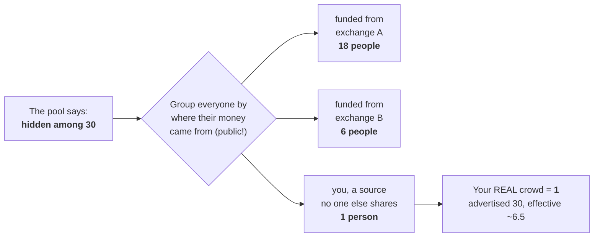
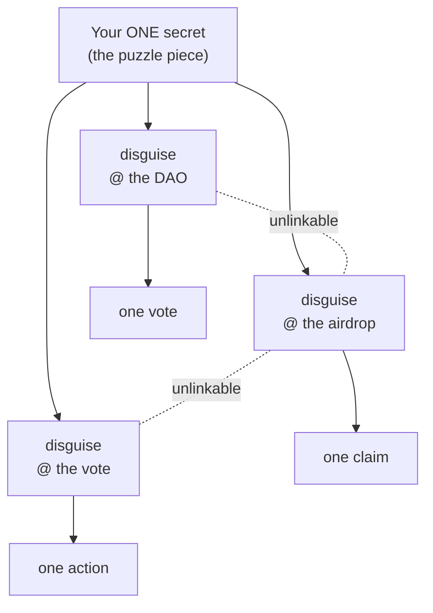
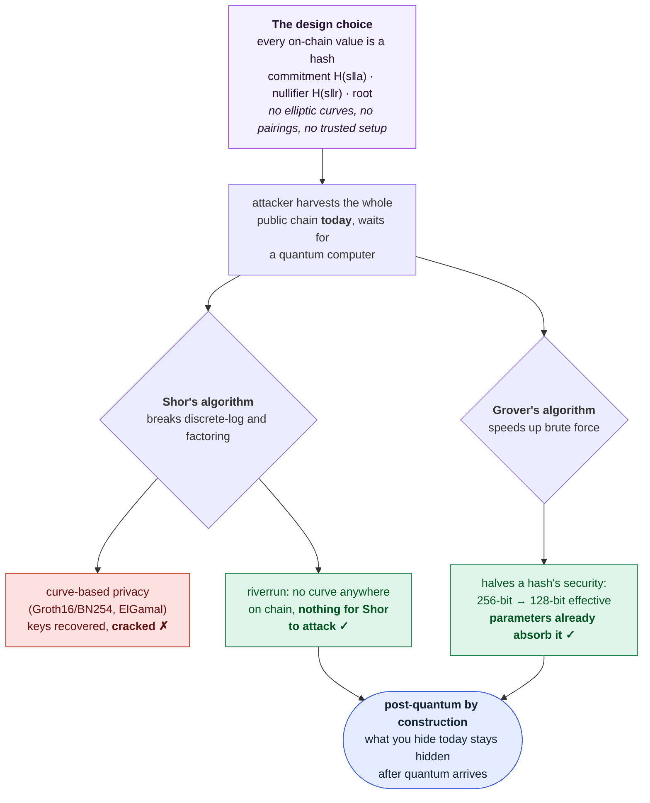

```
              ██
              ▀▀
  ██▄████   ████     ██▄  ▄██   ▄████▄    ██▄████   ██▄████  ██    ██  ██▄████▄
  ██▀         ██      ██  ██   ██▄▄▄▄██   ██▀       ██▀      ██    ██  ██▀   ██
  ██          ██      ▀█▄▄█▀   ██▀▀▀▀▀▀   ██        ██       ██    ██  ██    ██
  ██       ▄▄▄██▄▄▄    ████    ▀██▄▄▄▄█   ██        ██       ██▄▄▄███  ██    ██
  ▀▀       ▀▀▀▀▀▀▀▀     ▀▀       ▀▀▀▀▀    ▀▀        ▀▀        ▀▀▀▀ ▀▀  ▀▀    ▀▀
```

**The anonymity layer for Solana. Post-quantum.**

[](#use-it)
[](#why-post-quantum)
[](LICENSE)

Our goal is to empower people and to make knowledge accessible. Privacy is not
secrecy. It is the right to act without being profiled for it.

## In short

The submission that is **post-quantum, needs no trusted setup, and measures the
anonymity it delivers**, all at once (the only row in the [scorecard](#how-riverrun-compares)
that is). Five facts you can check in minutes:

- **Live on devnet.** A full 8-member round settled, the anonymity floor and
  anti-replay enforced by the program, every signature clickable in
  [`docs/DEVNET_ROUND.md`](docs/DEVNET_ROUND.md).
- **Measured, not advertised.** On a live mainnet pool, advertised `k = 30` was
  worth an effective **6.5**; a lone depositor exactly **1**. The ruler scores any
  pool, including the other submissions (`cargo run -p riverrun-trace ... audit`).
- **Post-quantum by construction.** Every on-chain value is a hash. No curves, no
  pairings, no trusted setup, nothing for Shor to break on a permanent ledger.
- **One round, one proof.** 16 memberships settle in a single **45 KB** STARK,
  about **8x** smaller than 16 separate, verified once.
- **More than a pool.** riverrun ID (seven unlinkable powers), a 47-page whitepaper
  with proofs, and **164 tests** green.

## In one breath

Everything you do on Solana is public and permanent. Anyone can trace your wallet
back to where your money came from and link your actions to you. riverrun lets a
crowd act as one: many people commit an intent, then a synchronized round performs
the same action from keys that are not yours, so an observer sees the action happen
but cannot say it was you. And riverrun does not just claim this. It **measures**
the anonymity you actually get, and it is built from hashes, so what it hides today
stays hidden after quantum computers arrive.

<p align="center">

</p>

## What riverrun does

Three things, in plain terms:

1. **Join a crowd.** You commit an intent to a pool. Your key appears once here,
   joining the crowd, and never again.
2. **Act unlinkably.** A synchronized round performs your action from a key that is
   not yours, at the same moment and the same shape as everyone else's, so the
   action on the permanent record cannot be traced back to you.
3. **Measure it.** Before you act, `preflight` tells you the real anonymity you
   would get. After, the ruler scores the pool. You never trust the number, you
   check it.

Your identity is one secret with a different unlinkable face in every context
(riverrun ID), so acting twice, one vote, one claim, never links back to you.

## Where it sits on Solana's privacy spectrum

Solana frames [privacy as a spectrum](https://solana.com/privacy), from pseudonymity
to full encryption. Most of that spectrum is **confidentiality**: hiding amounts and
state (Confidential Token Extensions, ZK compression, FHE, MPC). riverrun is the
other axis, **behavioral unlinkability**: it hides *who* acted, not *how much*, so
amounts stay public and auditable, which keeps it on the compliance-friendly side of
the line Solana itself draws. And across that whole spectrum, riverrun is the one
point that is **post-quantum with no trusted setup**. Anonymous DAO voting, one of
Solana's own named use cases, is exactly what riverrun ID is for.

## Why this is a paradigm shift, not an improvement

Three problems every other privacy pool leaves open, and riverrun closes.

**1. The trusted setup was a single point of failure.** Every Groth16 pool needs a
ceremony where someone generates a secret. If that secret leaks, everyone is
de-anonymized retroactively. It is a central server for privacy: if it falls,
everyone falls. riverrun has no secret and no ceremony. Nobody has to trust anybody.
It is pure math.

**2. The privacy has an expiry date, and nobody mentions it.** You vote anonymously
in a DAO in 2026. In 2035 someone with a quantum computer copies the whole chain,
runs Shor's algorithm, and learns it was you. Your nine-year-old privacy becomes
public. This is retroactive, and it is computation, not science fiction. riverrun is
built on hashes, which a quantum computer cannot break.

**3. Nobody measures the real privacy.** Every pool says "k = 30, you are hidden
among 30." Not true. If 20 came from Kraken, 5 from Coinbase, and you from OKX, your
real crowd is 1. You are alone. riverrun measures the funding graph and shows you the
number that matters. On a live mainnet pool, advertised 30 was worth an effective 6.5.

| before | riverrun |
|---|---|
| privacy that expires around 2035 | privacy that lasts |
| depends on a trusted ceremony | pure, verifiable math |
| "trust that it is 30" | "it is 6.5, measured, checkable" |
| works only today | proven to survive quantum |
| a commodity | infrastructure |

Solana is the most transparent chain in the world: everything is public. Great for
compliance, hard for privacy. riverrun is the first tool here to combine real
unlinkability (not just confidentiality), a proof of it instead of a promise,
survival of quantum computers, no trusted setup, and a full round settled on-chain
on devnet today. Verifying the post-quantum proof on-chain in one transaction, with
no committee, is the next milestone, named honestly in [Honest status](#honest-status).

The shift: before, "trust that you are private." Now, "see the proof that you are
private, and that you will stay private."

## How riverrun compares

riverrun does not hide *how much* you move. Confidential Token Extensions, FHE, and
MPC networks do that, and it is a different axis. riverrun hides *who*, and on that
axis, behavioral unlinkability, here is the honest scorecard.

| | hides who | hides amount | anonymity measured | post-quantum | no trusted setup | on-chain verify, live |
|---|:---:|:---:|:---:|:---:|:---:|:---:|
| **riverrun** | **yes** | no, public and auditable | **yes**, effective-k on mainnet | **yes**, hash-based | **yes** | committee today, STARK VM-proven |
| shielded pools (Privacy Cash, Tornado-style) | yes | yes, fixed denom | no | no, curve/Groth16 | no, ceremony | yes |
| mirror-pool (thomgabriel, this bounty) | yes, behavioral | no | yes, min-entropy | no, Groth16/BN254 | no, ceremony | yes, devnet |
| Confidential Token Extensions | no | yes | n/a | no, ElGamal | yes | yes, mainnet |
| Light Protocol (ZK compression) | partial | partial | no | no, curve/SNARK | no | yes |
| Arcium (MPC), Inco (FHE) | no | yes, encrypted compute | n/a | different model | varies | yes |

riverrun is the only row that is **post-quantum, needs no trusted setup, and
measures the anonymity it delivers** at once. The peer closest to it, a Groth16
behavioral pool, matches the behavioral idea and already verifies on-chain, but its
unlinkability is breakable by a future quantum computer and rests on a trusted-setup
ceremony. riverrun's does neither, and it adds an identity layer (riverrun ID) and a
ruler that scores live mainnet pools. That combination is the frontier. Where others
lead today, mainnet maturity and single-transaction on-chain verification, is named
honestly in [Honest status](#honest-status), because a comparison that hid it would
not be worth trusting.

## Why riverrun, not another tool

Every alternative gives up at least one of these. riverrun gives up none.

- **It lasts.** Curve-based pools (Groth16, ElGamal) are broken retroactively by a
  quantum computer, so on a permanent ledger their privacy has an expiry date.
  riverrun is hash-based, so it does not.
- **Nothing to trust.** SNARK pools need a trusted-setup ceremony whose leaked
  secret can forge proofs and drain the pool. riverrun has no ceremony and no secret
  to leak.
- **You measure, you do not hope.** Other pools advertise a member count. riverrun
  reports the anonymity you actually get once an adversary sorts members by funding
  provenance, and it shows the floor when a whale self-fills the round.
- **It is a layer, not one pool.** riverrun ID gives you a different unlinkable
  identity at every door, the Semaphore-class primitive Solana lacks.
- **It runs on mainnet today.** The measurement ruler scores live mainnet pools
  right now, not only inside a demo.

## What is real, with numbers

**You measure your anonymity, you do not trust it.** Every noise pool advertises
`1/k`. That counts members and ignores where their money came from, which on a
public chain is public. riverrun traces each wallet's funding graph and reports the
real number. On a live mainnet pool an advertised **k = 30** was worth an effective
**6.5**, and one depositor, alone in their funding class, was worth exactly **1**.
The ruler scores any pool, including the other submissions in this bounty.



**A full round, live on devnet.** Eight distinct members each committed (each
signing only their own commit), then a single relayer settled all eight actions
alone, with eight distinct nullifiers, and no member's key touched an execution.
The anonymity floor is enforced by the program, not promised: an execution
attempted before the crowd was complete was refused on-chain
(`0x1777`, `AnonymitySetTooSmall`), and a reused nullifier was rejected
(`0x0`, `NullifierSpent`). Every signature is checkable:
[`docs/DEVNET_ROUND.md`](docs/DEVNET_ROUND.md).

**One round, one proof.** A whole synchronized round batches: 16 memberships settle
in a single **45 KB** post-quantum STARK, about **8x** smaller than 16 separate
proofs, verified once.

**The floor is honest.** k is a ceiling, not a guarantee. If an adversary
self-fills the round (a Sybil, or a whale funding many notes), every slot they own
is one they subtract, and owning all but one leaves you alone at effective-k 1.
riverrun measures this floor instead of hiding it (`cargo run -p riverrun-eval`),
and defends it with a per-participant deposit cap and the funding-graph ruler.

**riverrun ID.** One secret, seven unlinkable powers (a different identity per
context, plus rate-limiting and rotation). Solana's missing Semaphore, post-quantum.



## Why post-quantum

Every value riverrun writes on chain is a hash: the commitment `H(secret‖action)`,
the nullifier `H(secret‖round)`, the root. There are no elliptic curves, no
pairings, and no trusted setup anywhere. An adversary can copy the whole chain today
and wait for a quantum computer; when it arrives, Shor's algorithm breaks the
curve-based privacy of a Groth16 pool retroactively, but finds nothing in riverrun
to break.



On a ledger that never forgets, this is the difference between privacy that lasts
and privacy with an expiry date. By Mosca's inequality, if what you hide must stay
hidden longer than it takes a quantum computer to arrive, a scheme that is not
already quantum-safe has lost. That is why a permanent-ledger privacy tool in 2026
must be post-quantum, not may. An honest, balanced comparison against curve-based
pools, including where they are ahead today, is in
[`docs/POST_QUANTUM_VS_CURVE_POOLS.md`](docs/POST_QUANTUM_VS_CURVE_POOLS.md).

## Use it

```bash
# the adversarial evidence: the attacker deanonymizes the unprotected trace,
# riverrun drives it to chance, and the self-fill floor is measured, not hidden
cargo run -p riverrun-eval

# your own anonymity, before you act (needs live data)
cargo run -p riverrun-trace --features onchain --bin riverrun -- preflight <WALLET>

# any pool's real effective-k vs the k it advertises
cargo run -p riverrun-trace --features onchain --bin riverrun -- audit <POOL> 30

# the post-quantum posture and the Mosca inequality, in the terminal
cargo run -p riverrun-trace --features onchain --bin riverrun -- pq

# the self-fill floor: advertised k vs the real anonymity a whale leaves you
cargo run -p riverrun-trace --features onchain --bin riverrun -- floor 30

# plain answers, because knowledge should be accessible
cargo run -p riverrun-trace --features onchain --bin riverrun -- explain post-quantum

# the whole workspace
cargo test --workspace                                   # 105 tests green

# the live devnet round, reproduced (needs the Solana toolchain + devnet SOL)
cargo run --manifest-path programs/mirror-pool/Cargo.toml --example devnet_round 8
```

## Honest status

**Live today:** the measurement ruler on mainnet, the full round on devnet, and
committee-attested settlement that moves real value with the member's key absent.

**Still ahead:** the post-quantum STARK membership proof, verified on a live cluster
in one transaction with no committee. The transparent Winterfell proof is **3.77M
compute units**, above Solana's 1.4M per-transaction cap, so today it is verified
off-chain and gated on-chain by an M-of-N committee. A Circle STARK over the
Mersenne-31 field fits a single transaction (verified end to end in the Solana VM at
**159,849 CU**, with riverrun's action binding), but not yet on riverrun's full
Merkle-path relation. Closing that is the next milestone, and it is specified, not
hand-waved: [`docs/M31_CIRCLE_STARK.md`](docs/M31_CIRCLE_STARK.md).

Nothing here is faked. Every claim has a test, a signature, or a measured number
beside it, and every limitation is named where the claim is made.

## Read more

- **[Whitepaper (PDF)](paper/riverrun.pdf)**: the philosophy, the cryptography, and
  the mathematics of anonymity, with proofs.
- [`docs/DEVNET_ROUND.md`](docs/DEVNET_ROUND.md): the live round, every signature.
- [`docs/POST_QUANTUM_VS_CURVE_POOLS.md`](docs/POST_QUANTUM_VS_CURVE_POOLS.md): hash
  vs curve, honestly.
- [`docs/EFFECTIVE_K.md`](docs/EFFECTIVE_K.md): the ruler and the arithmetic behind
  it.

MIT. **164 tests green** across the repo (105 in the default workspace, plus the
excluded heavy crates: STARK 31, mirror-pool 21 e2e, pool-zk 7).

The name is the first word of *Finnegans Wake*: a river that flows back into its own
beginning. A private action returns you to the crowd you came from.
